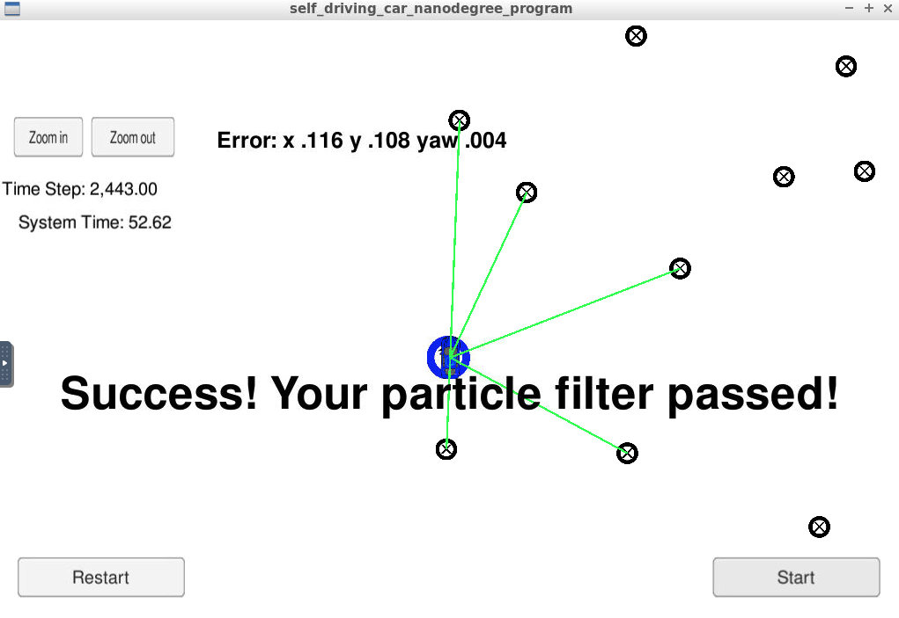
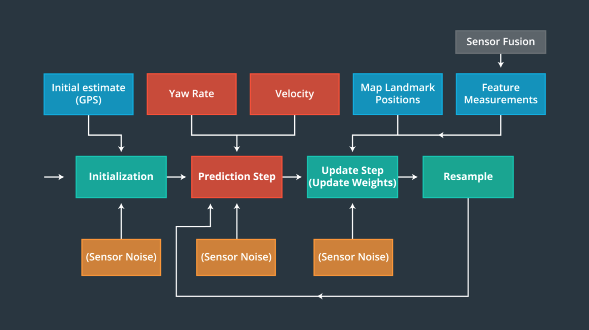
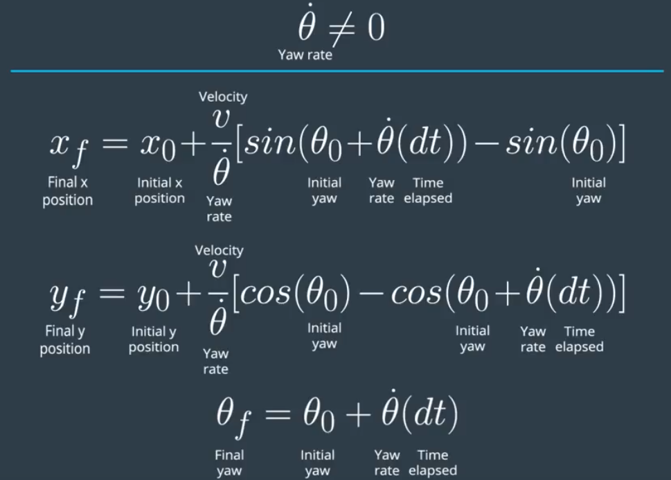
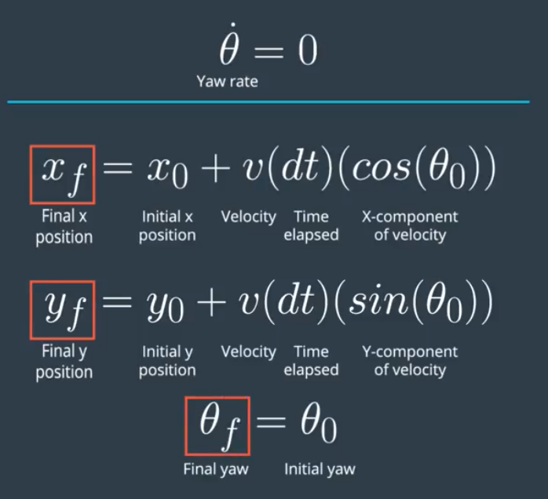
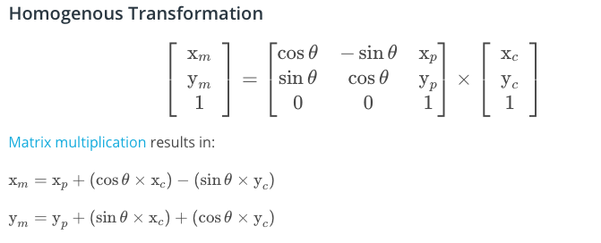
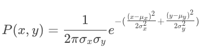
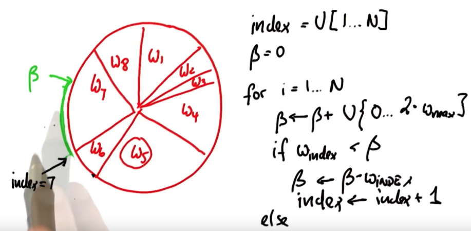

# Particle Filter for vehicle localization
[](http://www.udacity.com/drive)

# Objective: Localization 
A self driving car is moved to an alien world with limited and noisy data. The alien world has a map, a noisy GPS with erronous sensor and control data. This project will implement a two dimensional particle filter in C++ to localize the car for autonomous driving. The particle filter will have access to the map, noisy initial localization information from GPS and noisy observation and control data from the sensors.

# Project Output
Particle filter was implemented in C++ and executed in Udacity's simulator, which is an enclosed environment for running autonomous cars. The environment simulates road conditions, sensor data, feedback and other mechanisms for testing and running various components of self driving. Kidnapped Vehicle simulation was used for building and testing the particle filter. 

### Final Video
[Particle Filter](https://www.youtube.com/watch?v=myd3ctSHtts)

# Filter Design and Implementation
## Filter design is depicted below. 


## Major implementation steps:
#### 0. Directory structure:
```
root
|   build.sh
|   clean.sh
|   CMakeLists.txt
|   README.md
|   run.sh
|___data   
|   |   map_data.txt   
|___src
    |   helper_functions.h
    |   main.cpp
    |   map.h
    |   particle_filter.cpp
    |   particle_filter.h
```
#### Inputs to the Particle Filter
You can find the inputs to the particle filter in the `data` directory.
#### The Map*
`map_data.txt` includes the position of landmarks (in meters) on an arbitrary Cartesian coordinate system. Each row has three columns
1. x position
2. y position
3. landmark id
#### All other data the simulator provides, such as observations and controls.
> * Map data provided by 3D Mapping Solutions GmbH.

### 1. Particle::Init
A noisy measurement from GPS was used to initialize all particles. After initialization Gaussian noise is added with standard deviation same as GPS data. The number of particles was chosen based on the examples mentioned in class notes and further imperically validated.

### 2. Particle::Prediction
After particle initialization, the prediction step was added. The main idea is to predict the particle's x,y and theta based on car's motion using a set of equations as depicted below.



### 3. Particle::dataAssociation:
The main idea is to find the predicted measurement that is closest to each observed measurement and assign the observed measurement to that particular landmark.

Before finding the smallest distance, observations which are in the VEHICLE'S coordinate system are transfromed to particles coordinate system. Particles are located according to the MAP'S coordinate system. This tranformation is done using the below mentioned equation with an assumption that we are doing homogenous transformation.


### 3. Particle::updateWeights
The particles' final weight was calculated as the product of each measurement's Multivariate-Gaussian probability density using the below equation. Note: x and y are the observations in map coordinates. μx and μy are the coordinates of the nearest landmarks. Standard deviation for x and y


### 4. Particle::resample:
This was impletemented using a wheel approach as design by Dr. Sebastian Thrun, Udacity.  The logic is to represent all particles and importance/weight in a big wheel(circle). Each particle occupies a pie equal to its importance/weight. Particle with large weight will occupy larger pie of the circle and vice versa. To start, a particle index was generated from the uniformly distributed index set of particles. A function was constructed to find the best index i.e. each particle picked is in proportion to the total circumference. 


## Running the Code
1. Clone the github repo
1. Run ./clean.sh to remove old object and linker files
2. Run ./build.sh to make a fresh build
3. Run ./run.sh to execute the particle filter 

INPUT: values provided by the simulator to the c++ program
// sense noisy position data from the simulator
["sense_x"]
["sense_y"]
["sense_theta"]

// get the previous velocity and yaw rate to predict the particle's transitioned state
["previous_velocity"]
["previous_yawrate"]

// receive noisy observation data from the simulator, in a respective list of x/y values
["sense_observations_x"]
["sense_observations_y"]

OUTPUT: values provided by the c++ program to the simulator
// best particle values used for calculating the error evaluation
["best_particle_x"]
["best_particle_y"]
["best_particle_theta"]
